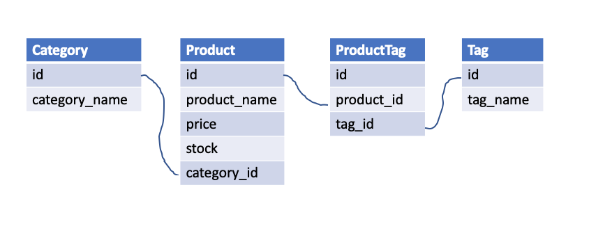

## E-Commerce Back End - Week 13 Homework

## Description

E-commerce is a big sector of the electronics industry and such platforms provide a suite of services to a plethora of businesses. I was tasked to build the back end of an e-commerce site by modifying starter code. The application uses an Express.js API through sequelize to interact with a MySQL database.

## Table of Contents

- [User Story](#user-story)
- [Acceptance Criteria](#acceptance-criteria)
- [Models](#models)
- [Routes](#routes)
- [License](#license)
- [Link](#link)

## User Story

```md
AS A manager at an internet retail company
I WANT a back end for my e-commerce website that uses the latest technologies
SO THAT my company can compete with other e-commerce companies
```

## Acceptance Criteria

```md
GIVEN a functional Express.js API
WHEN I add my database name, MySQL username, and MySQL password to an environment variable file
THEN I am able to connect to a database using Sequelize
WHEN I enter schema and seed commands
THEN a development database is created and is seeded with test data
WHEN I enter the command to invoke the application
THEN my server is started and the Sequelize models are synced to the MySQL database
WHEN I open API GET routes in Insomnia for categories, products, or tags
THEN the data for each of these routes is displayed in a formatted JSON
WHEN I test API POST, PUT, and DELETE routes in Insomnia
THEN I am able to successfully create, update, and delete data in my database
```

## Models

The models, through sequelize, were created based on the following schema outline:



All four models were then exported from their individual files, imported into the index.js file within the model folder and linked. The Product and Tag models have a many-to-many relationship which was defined through the use of the ProductTag model. The Product model also belonged to Category Model and Categories can have many Products.

## Routes

There are three different route files for the categories, tags, and products. Each route file contains two GET requests, as well as POST, PUT, and DELETE. One of the GET requests pulls all of the categories, products, or tags. The second GET request allows the user to find a category, product, or tag based on id. I edited the routes for all of the methods aside from the POST and PUT requests within the product-routes file as those were provided in the starter code.

## License

[](https://opensource.org/licenses/MIT)

This project is protected under the MIT License.

## Link

See the following for a link to the walkthrough video: https://youtu.be/fBqYM-844ec
